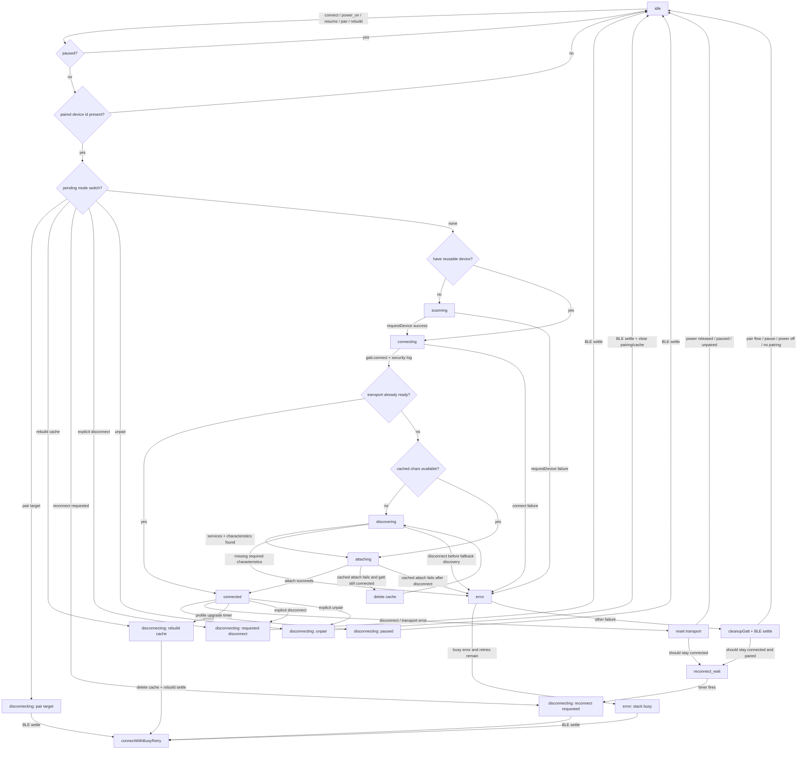
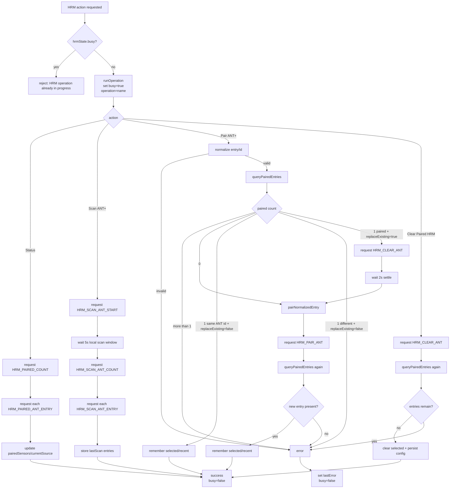

# CoreTemp

Connect a Bangle.js watch to a [CORE](https://corebodytemp.com/) or
[calera](https://info.greenteg.com/calera-research) sensor from greenteg and
display live body temperature data.

CoreTemp also installs a `CORESensor` module so other apps, widgets, and
recorders can subscribe to the same sensor readings.

## What It Provides

- A foreground app that temporarily powers a paired CORE sensor while open and
  shows CORE temperature, skin temperature, Heat Strain Index, and battery
  level.
- A background runtime that keeps a paired CORE sensor connected when enabled.
- A widget that is visible when the feature is enabled and changes color when
  the CORE sensor is connected.
- A recorder integration that logs core temperature data into Recorder.
- An ANT+ HRM manager for pairing a heart-rate monitor through the CORE
  Control Point characteristic.

## Setup

1. Install CoreTemp from the Bangle.js app loader.
2. Open `Settings > Apps > CoreTemp`.
3. Use `Scan for CORE` to find and pair your CORE/calera sensor.
4. Enable `Enable` only if you want CoreTemp itself to keep CORE connected in
   the background.
5. Enable `Widget` if you want connection status on the clock screen.

By default, CoreTemp installs disabled and does not keep CORE connected in the
background. Opening the CoreTemp app starts an active foreground session for a
paired CORE sensor without changing the background `Enable` setting. When
background mode is enabled, the boot task loads the runtime automatically. The
runtime connects to the paired CORE sensor, subscribes to measurements, and
emits a `CORESensor` event for each reading.

## Settings

The main settings menu contains:

- `Enable`: turns the background CORE runtime on or off.
- `Widget`: shows or hides the CoreTemp widget.
- `Scan for CORE`: scans for CORE sensors when no CORE device is paired.
- `Test <device>`: connects to the currently paired CORE sensor when it is not
  already connected.
- `Forget <device>`: removes the saved CORE sensor, disables background CORE
  connection, and clears cached BLE characteristic handles without erasing
  global Bangle BLE bonds.
- `HRM (ANT+)`: opens heart-rate monitor management for the paired CORE sensor.
- `Debug`: contains disconnect warning, debug logging, status, cache rebuild,
  and `Reset CoreTemp` actions.
- `Full log`: records all debug lines, including every measurement event.
- `Partial log`: records connection/discovery/control logs but skips measurement
  `data` lines to reduce log volume.
- `Custom CORE only`: requires CORE's custom temperature characteristic and
  disables the standard Health Thermometer fallback.

## ANT+ HRM Pairing

CORE can pair with a heart-rate monitor and use that heart-rate data for its own
accuracy. CoreTemp manages ANT+ HRMs through CORE's Control Point
characteristic.

Open `Settings > Apps > CoreTemp > HRM (ANT+)`.

Available actions:

- `Status`: queries the CORE sensor for currently paired ANT+ HRMs.
- `Scan ANT+`: starts an ANT+ scan on CORE, waits 5 seconds locally, then
  reads the found HRM IDs. Scan results may include HRMs already paired on
  CORE.
- `Recent HRMs`: shows HRMs previously paired through CoreTemp.
- `Clear Paired HRM`: clears ANT+ HRMs paired on CORE and verifies the result.

Pairing flow:

1. Choose `Scan ANT+`.
2. Wait for the 5 second scan window.
3. Select a found ANT+ HRM ID.
4. Choose `Pair`.
5. CoreTemp verifies pairing by reading CORE's paired HRM status.

CoreTemp treats pairing as a single-HRM app policy:

- If no HRM is paired, the selected HRM is paired.
- If one HRM is already paired, CoreTemp asks whether to replace or re-pair it.
  Replacement clears CORE's paired HRM, waits 2 seconds, then pairs the
  selected HRM.
- If multiple HRMs are paired, clear paired HRMs before pairing another one.

There is no manual ANT ID entry in the on-watch settings UI. The watch pairing
path is scan, select, pair. Previously paired HRMs can be paired again from
`Recent HRMs`.

## BLE Lifecycle

`ble.js` serializes connect, reconnect, pause, pair, unpair, and cache rebuild
work through one lifecycle queue. The state machine below shows the runtime
states, the main transitions between them, and the recovery branches that feed
back into reconnect.



Key points:

- Cached characteristic fallback is only allowed to rebuild/discover while the
  current GATT is still connected. If the transport drops first, the lifecycle
  aborts, cleans up, settles, and lets the reconnect loop retry.
- The standard Health Thermometer fallback can reach `connected`, but a profile
  upgrade timer later forces a controlled reconnect and cache rebuild so the
  runtime can switch to the custom CORE service when it becomes available.
- Transport disconnects from notifications or Control Point traffic do not try
  to recover inline. They request a queued reconnect so all BLE transitions
  still pass through the same serialized lifecycle.

## HRM ANT+ Lifecycle

All HRM actions run through `hrm.js`, which uses `controlpoint.js` as a strict
single-request actor on top of the connected CORE Control Point characteristic.
Unexpected or stale indications are discarded by the Control Point layer and do
not change the HRM workflow.



HRM notes:

- `Status`, `Scan ANT+`, `Pair ANT+`, and `Clear Paired HRM` are all verified
  reads or write-then-read flows. The module does not trust an ACK alone.
- `pairANT` enforces a single-HRM app policy: same ID is idempotent only when
  `replaceExisting` is false. With `replaceExisting`, the flow clears, waits
  2 seconds, and pairs the selected HRM. Multiple paired HRMs are treated as a
  manual cleanup case.
- Control Point transport errors still come from the BLE layer. If the CORE
  connection drops, the HRM operation fails, `lastError` is recorded, and BLE
  recovery continues through the reconnect lifecycle above.

## CORESensor Events

Apps can enable the runtime and listen for readings:

```js
require("CORESensor").enable();
Bangle.setCORESensorPower(1, "myapp");
Bangle.on("CORESensor", function (data) {
  // Use CORE sensor data here.
});
```

Release power when your app no longer needs the sensor:

```js
Bangle.setCORESensorPower(0, "myapp");
```

Each `CORESensor` event contains:

- `core`: estimated/predicted core temperature, or the CORE invalid sentinel
  when unavailable.
- `skin`: measured skin temperature.
- `unit`: `"C"` or `"F"`.
- `hr`: heart-rate value from CORE measurements when provided, otherwise `0`.
- `hrState`: CORE heart-rate state when provided by the measurement flags.
- `heatflux`: heat flux value.
- `hsiValid`: whether `hsi` is valid.
- `hsi`: Heat Strain Index value from CORE's exertional algorithm.
- `battery`: CORE battery level.
- `dataQuality`: measurement quality/trust level from the low bits of CORE's
  quality/state byte.
- `flags`: raw measurement flags.

## Runtime APIs

After `require("CORESensor").enable()`, CoreTemp exposes these helpers on
`Bangle`:

```js
Bangle.isCORESensorOn();
Bangle.isCORESensorConnected();
Bangle.CORESensorConnect();
Bangle.CORESensorDisconnect();
Bangle.CORESensorPair(deviceOrId, name);
Bangle.CORESensorUnpair();
Bangle.CORESensorRebuildCache();
Bangle.CORESensorGetStatus();
Bangle.setCORESensorPower(on, owner);
Bangle.CORESensorPause(owner);
Bangle.CORESensorResume(owner);
Bangle.CORESensorIsPaused();
```

`setCORESensorPower` records whether an owner wants CORE connected.
`CORESensorPause` temporarily yields the BLE stack without changing any stored
settings, pairing, or power owner.

Debug helpers:

```js
Bangle.enableCORESensorLog();
Bangle.disableCORESensorLog();
Bangle.CORESensorSetDebugLog(true);
```

HRM helpers:

```js
Bangle.CORESensorHRMGetState();
Bangle.CORESensorHRMGetStatus();
Bangle.CORESensorHRMScanANT();
Bangle.CORESensorHRMPairANT(entryOrId, replaceExisting);
Bangle.CORESensorHRMClearANT();
```

`CORESensorHRMPairANT` remains available for scripts or other apps, but the
watch settings UI does not expose manual ID input.

## Control Point Model

CoreTemp's HRM support is split into small modules:

- `protocol.js`: CORE UUIDs, opcodes, measurement parsing, Control Point
  response parsing, and ANT entry parsing.
- `controlpoint.js`: one strict Control Point request actor. It writes one
  opcode at a time and only settles on a matching `[0x80, opcode, ...]`
  indication.
- `hrm.js`: user-level HRM workflows such as scan, status, pair, recent HRMs,
  and clear.
- `ble.js`: CORE BLE connection, service discovery, characteristic caching, and
  notification forwarding.

Unexpected, stale, or mismatched Control Point indications are logged and
discarded. They are not surfaced as HRM workflow errors.

## BLE Compatibility

CoreTemp supports CORE's custom Core Body Temperature Service:

- Service: `00002100-5b1e-4347-b07c-97b514dae121`
- Temperature characteristic: `00002101-5b1e-4347-b07c-97b514dae121`
- Control Point characteristic: `00002102-5b1e-4347-b07c-97b514dae121`

For older/basic compatibility it also accepts the standard BLE Health
Thermometer profile:

- Service: `0x1809` / `00001809-0000-1000-8000-00805f9b34fb`
- Temperature Measurement characteristic: `0x2a1c` /
  `00002a1c-0000-1000-8000-00805f9b34fb`

The standard Health Thermometer path provides temperature readings only. CORE
Control Point and ANT+ HRM management require the custom Control Point
characteristic.

When CoreTemp falls back to Health Thermometer mode, it periodically performs a
background profile upgrade attempt. This disconnects briefly, rebuilds the
characteristic cache, and switches to the custom CORE profile if it is available.

Enable `Custom CORE only` in Debug if you want CoreTemp to reject the standard
Health Thermometer fallback and keep reconnecting until the custom CORE
temperature characteristic is available.

## Storage

CoreTemp stores:

- `coretemp.json`: app settings, paired CORE device ID/name, debug flag, and BLE
  characteristic cache.
- `coretemp.hrm.json`: selected and recent ANT+ HRMs.
- `coretemp.log`: debug log output when debug logging is enabled.

The repository also includes `apps/coretemp/tests/` for local regression tests.
That folder is committed for development but is not listed in `metadata.json`,
so it is not installed on the watch.

## Recorder

The Recorder integration is named `Core` and records:

- Core
- Skin
- Unit
- HeatFlux
- HeatStrainIndex
- Battery
- Quality

Recorder powers the CORE runtime while recording and releases it when recording
stops.

## Development Tests

From the repository root:

```sh
node apps/coretemp/tests/run.js
```

The tests cover protocol parsing, the strict Control Point actor, HRM scan,
pair/status/clear behavior, BLE Control Point forwarding, runtime exports,
settings menu behavior, and manifest packaging.

## Creators/Contributors

Ivor Hewitt

[Nicholas Ravanelli](https://github.com/nravanelli)

[Zheng Yifei](https://github.com/zyf0717)
