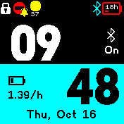

# Daily Color Clock
A clock that randomly changes the accent color every day to freshen up the clock face every day. This app uses a queue based color system, so each day is not a repeat of the previous color. It is generated in a random order when you manually regenerate, or when the old queue runs out.

The app is designed to be as battery-friendly as possible, and clears certain areas and utilizes string background to remove the need for full screen clears/draws. If any problems arise where the background has another app/terminal behind it, simply reload the clock.
## Settings
### Show/hide widgets
Choose whether widgets are shown or hidden
### Regenerate queue
If you changed any color toggles, the queue will not update by itself. Instead, regenerate the queue here, or wait until the queue runs out and is automatically regenerated after a certain number of days.
### Dithered colors
Colors that are dithered, which may affect quality.

#### Adding your own colors
To add your own colors to the mix, go to `dailycolorclk.settings.js` in the web IDE and add your own color entries to the `colors` list. The list takes an object that contains a name, the hex code of the color to display, and a boolean for whether it's dithered or not.

From there, upload it, and if you go to the settings page, there will be a new color in the dithered or normal section that you can toggle to add your color to the queue.

## Creator
RKBoss6
