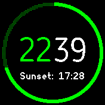
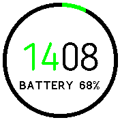
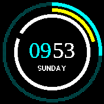

# Daisy 

  *A beautiful digital clock with large ring guage, idle timer and a
   cyclic information line that includes, day, date, steps, battery,
   sunrise and sunset times*

Written by: [Hugh Barney](https://github.com/hughbarney) and [David Volovskiy](https://github.com/voloved)
For support and discussion please post in the [Bangle JS Forum](http://forum.espruino.com/microcosms/1424/)

* Derived from [The Ring](https://banglejs.com/apps/?id=thering) proof of concept and the [Pastel clock](https://banglejs.com/apps/?q=pastel), though all rings are dynamically created.
* Includes the [Lazybones](https://banglejs.com/apps/?q=lazybones) Idle warning timer
* Touch the top right/top left to cycle through the info display (Day, Date, Steps, Sunrise, Sunset, Heart Rate, Battery Estimate)
* The heart rate monitor is turned on only when Heart rate is selected and will take a few seconds to settle
* The heart value is displayed in RED if the confidence value is less than 50%
* NOTE: The heart rate monitor of Bangle JS 2 is not very accurate when moving about.
See [#1248](https://github.com/espruino/BangleApps/issues/1248)
* Uses mylocation.json from MyLocation app to calculate sunrise and sunset times for your location
* If your Sunrise, Sunset times look odd make sure you have setup your location using
[MyLocation](https://banglejs.com/apps/?id=mylocation)
* The screen is updated every minute to save battery power, unless a ring is set to display seconds or steps.
* Uses the [BloggerSansLight](https://www.1001fonts.com/rounded-fonts.html?page=3) font, which if free for commercial use
* You need to run >2V22 to show the battery estimate in hours
* In the settings, the rings can be set to:
  *  Hours - Displays the ring as though it's the hour hand on an analog clock.
  *  Minutes - Displays the ring as though it's the minute hand on an analog clock.
  *  Seconds - Displays the ring as though it's the seconds hand on an analog clock. This option uses far more battery than any other option as it updates the screen 60 times more often.
  *  Day - Displays the ring as how much of the day is left. Functionally, it fills the ring half as quickly as the Hours option.
  *  Steps - Displays the ring as the amount of steps taken that day out of Step Target setting.
  *  Battery - Displays the ring as the amount of battery percentage left.
  *  Sun - Displays the ring as the amount of time that has passed from sunrise to sunset in the day and the amount of time between sunset and sunrise at night.
* The rings have the following displays
  *  None - Don't display the ring at all.
  *  Full - Display a full circle, where the filled-in part of the circle's color differs with the unfilled section.
  *  Semi - Similar to full, but the unfilled section does not display.
  *  C - Displays a full circle with a notch.

## Future Development
* Use mini icons in the information line rather that text
* Add weather icons as per Pastel clock
* Add a lock icon to the screen

## Screenshots

It is worth looking at the real thing though as the screenshots do not do it justice.
