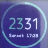

# Daisy

  *A beautiful digital clock with large ring guage, idle timer and a
   cyclic information line that includes, day, date, steps, battery,
   sunrise and sunset times*

Written by: [Hugh Barney](https://github.com/hughbarney) For support
and discussion please post in the [Bangle JS
Forum](http://forum.espruino.com/microcosms/1424/)

* Derived from `The Ring` proof of concept and the [Pastel clock](https://banglejs.com/apps/?q=pastel)
* Includes the [Lazybones](https://banglejs.com/apps/?q=lazybones) Idle warning timer
* Touch the top right/top left to cycle through the info display (Day, Date, Steps, Sunrise, Sunset)
* Uses mylocation.json from MyLocation app to calculate sunrise and sunset times for your location
* The screen is updated every minute to save battery power
* Uses the [BloggerSansLight](https://www.1001fonts.com/rounded-fonts.html?page=3) font, which if free for commercial use

## Future Development
* Add settings menu to change primary clock color
* Add a heart rate option in the information line that turns on when selected
* Use mini icons in the information line rather that text
* Add weather icons as per Pastel clock
* Add a lock icon to the screen

## Screenshots

It is worth looking at the real thing though as the screenshot does not do it justice.
(Though I need to redo this photo at some point)

