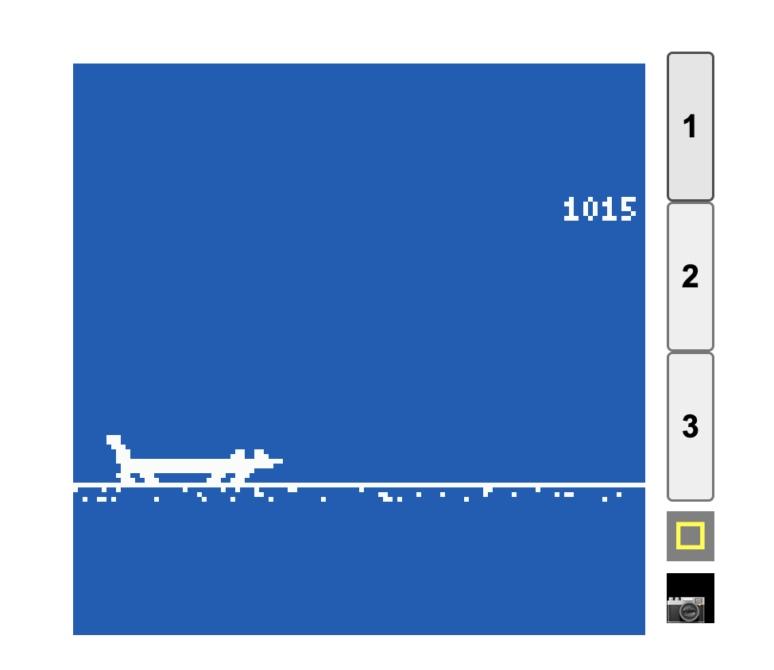

# Dash Hound
This is a side scrolling endless runner game. The main character is Dash the dachshund.
Dash loves running in the hot dessert climates and making daring leaps of cacti at high speed.
Help Dash jump those cacti, make sure he doesn't land on one or run into one, otherwise he'll explode!
Happy Hounding :D

## Controls
Open app and use BTN1 to pass opening screen.
During the game, you'll see Dash on the left hand side of the screen and Cacti coming from the right.
Use BTN1 to jump the cacti.
If you hit a cacti and explode you can use BTN1 to restart the game.
You can always exit the game by holding BTN3.

Track your score in the top right corner.
If you want to make things trick try using the touchscreen to move left and right!

This screenshot is on the emulator, but gameplay is optimised for the device. The emulator runs too quickly.

