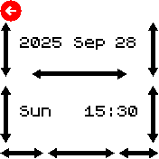
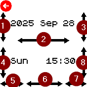

# App Name

Datetime Picker allows to swipe along the bars to select date and time elements, e.g. for the datetime of Events in the Alarm App.

Screenshot: 

## Controls

Swipe to increase or decrease date and time elements.  Press button or go back to select shown datetime.

1. Year: swipe up to increase, down to decrease
2. Month: swipe right to increase, left to decrease
3. Day: swipe up to increase, down to decrease
4. Week: swipe up to increase week (same day next week), down to decrease (same day previous week)
5. Weekday: swipe right to increase, left to decrease (basically the same effect as 3, but with a focus on the weekday)
6. Hour: swipe right to increase, left to decrease
7. Minutes: swipe right to increase, left to decrease
8. 15 minutes: 00, 15, 30 or 45 minutes; swipe up to increase, down to decrease; wrap-around i.e. goes back to 00 after increasing from 45

## How to use it in code

Sample code which would show a prompt with the number of days and hours between now and the selected datetime:

    require("datetimeinput").input().then(result => {
        E.showPrompt(`${result}\n\n${require("time_utils").formatDuration(Math.abs(result-Date.now()))}`, {buttons:{"Ok":true}}).then(function() {
            load();
        });
    });

To set the initial value, pass a Date object named _datetime_, e.g. for today at 9:30 :

        var datetime = new Date();
        datetime.setHours(9, 30);
        require("datetimeinput").input({datetime}).then(...