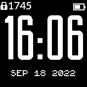
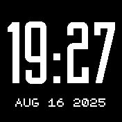

# Deko Clock

A simple clock with an Art Deko font.

Widgets can be configured to be always on, always off, or only shown when unlocked.

The font was obtained from https://dafonttop.com/building.font and is free for personal use.

 

Written by: [Hugh Barney](https://github.com/hughbarney)  
Optional widgets settings added by [Trippnology](https://github.com/trippnology)

For support and discussion please post in the [Bangle JS Forum](http://forum.espruino.com/microcosms/1424/)
