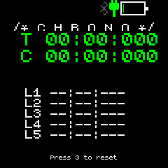
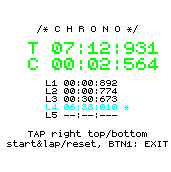

# dev stop watch

stores state at kill

## Bangle 1

* BTN1: start/lap
* BTN2: launcher
* BTN3: reset

## Bangle 2

* TAP top right: start/lap
* TAP bottom right: reset
* Use BTN to get to launcher

