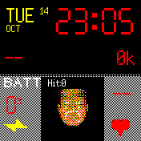

# Doomguy Clock

A DOOM-inspired watch face featuring the iconic Doomguy face that reacts to your battery level!

## Features

### Dynamic Doomguy Face
- **Battery-Reactive**: Doomguy's face changes based on your battery level:
  - 80-100%: Normal face
  - 60-80%: Slightly damaged
  - 40-60%: More damaged
  - 20-40%: Heavily damaged
  - 0-20%: Critical damage
  - **Charging**: God mode (invincibility face)!

### Face Animation
- Doomguy periodically looks left, right, and center
- Animation occurs every 2-3 seconds when unlocked
- Pauses when watch is locked to save battery

### HUD Display
- **Time**: Large red digital time display
- **Date**: Yellow date text (day of week, month, day)
- **Battery**: Shows percentage with "BATT" label
- **Heart Rate**: Current BPM displayed with heart icon
- **Steps**: Daily step count
- **Temperature**: Current watch temperature
- **Charging Indicator**: Yellow lightning bolts appear when charging

### Visual Elements
- **Heart Icon**: Red heart in lower right corner
- **Lightning Bolts**: Two yellow triangles in lower left when charging
- **Gray HUD Panels**: Left (battery) and right (stats) panels
- **Hit Counter**: Displays daily tap count

## Interactive Features

### Tap to Hit
- **Tap Doomguy's Face**: Interactive hit counter
  - Screen flashes yellow twice
  - Face shows damage reaction (damaged2_center)
  - Hit counter increments
  - Counter resets automatically each day
  - Hit count persists through app restarts

## Controls

- **Tap Face**: Trigger hit animation and increment daily counter
- **Swipe Down**: Show widgets
- **Lock Watch**: Pauses face animation to save battery
- **Unlock Watch**: Resumes face animation

## Technical Details

- Uses 4-bit color depth for memory efficiency
- Heatshrink compression for sprite storage
- 16 different face sprites (5 damage levels × 3 directions + 1 god mode)
- Each sprite: 60×60 pixels
- Optimized for Bangle.js 2

## Memory Optimization

This watch face uses advanced memory optimization techniques:
- Sprites stored as compressed 4-bit palette images
- On-demand decompression
- Efficient animation timer management
- Persistent storage for daily hit counter
- Minimal memory footprint for smooth operation

## Credits

**Character Inspiration**: Inspired by the classic DOOM game's status bar face by id Software.

**Code Base**: Based on the Advanced Casio Clock by [dotgreg](https://github.com/dotgreg/advCasioBangleClock)
- Original template: [Advanced Casio Clock](https://github.com/dotgreg/advCasioBangleClock)
- Creator: [dotgreg](https://github.com/dotgreg)
