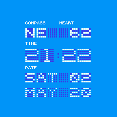

# Dotmatrix clock

A clock face simulating the classic dotmatrix displays. Shows time, date, compass, and heart rate.

## Features

* Easy to read digits
* Simulated white-on-blue dotmatrix display
* Compass
* Heart rate monitor
* Multiple colour palletes, swipe to change

## Usage

### Sensor readings

When the display is activated by 'flipping' the watch up, the compass and heart sensors will be activated automatically, but if 
you activate the LCD through a button press, then the sensors will remain off until you press button-1.

### Colours

The display defaults to blue, but you can change this to orange by swiping the screen

## Requests

If you have any feature requests, please send an email to the author paulcockrell@gmail.com`
