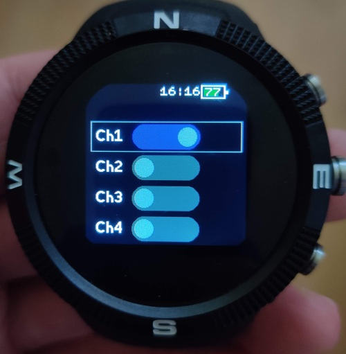

# DSDRelay

Small app to control DSD Tech BLE relay boards from the watch. I have seen them being sold as 1-, 2- and 4-relay boards. The app shows controls for
4 relays, regardless of the actual configuration of the board connected.

## Controls
- buttons 1 and 3 cycle the selection of the currently active channel
- swipe right turns the selected channel's relay *on*
- swipe left turns the selected channel's relay *off*

I only own a 1-relay board, so only the "Ch 1" functionality was tested; the other channels were implemented per the manufacturer's documentation.
In particular, the method for determining the relay states on app startup for channels 2-4 was mostly an educated guess.
