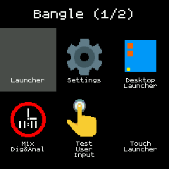

# Desktop style App Launcher

Bangle 1:

In the picture above, the Settings app is selected.

Bangle 2:

## Controls

### Bangle 1

**BTN1** - move backward through app icons on a page

**BTN2** - run the selected app

**BTN3** - move forward through app icons

**Swipe Left** -  move to next page of app icons

**Swipe Right** - move to previous page of app icons

**Touch Left(1) area** -  "Back" to Clock

**Touch Right(2) area** - move forward through app icons

**Touch Middle(1+2) area** - run the selected app

### Bangle 2

**Touch** - icon to select, second touch launches app

**Swipe Left/Up** -  move to next page of app icons

**Swipe Right/Down** - move to previous page of app icons

## Settings

**Show clocks**

**Show launchers**

### Only Bangle 2

**Direct launch** - launch on first touch.

**Swipe Exit** - Swipe left to exit.

**Time Out** - Return to clock after a short while.

**Interaction buzz**

**Remember Page** - Remember page when leaving and coming back to the launcher.
