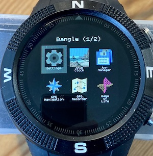

# Desktop style App Launcher

In the picture above, the Settings app is selected.
## Controls- Bangle

**BTN1** - move backward through app icons on a page

**BTN2** - run the selected app

**BTN3** - move forward through app icons

**Swipe Left** -  move to next page of app icons

**Swipe Right** - move to previous page of app icons

## Controls- Bangle 2

**Touch** - icon to select, scond touch launches app

**Swipe Left** -  move to next page of app icons

**Swipe Right** - move to previous page of app icons