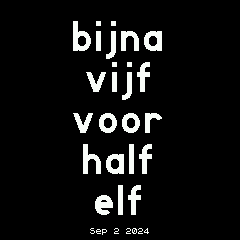
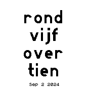
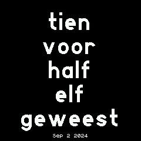

# Dutch Clock
This clock shows the time, in words, the way a Dutch person might respond when asked what time it is. Useful when learning Dutch and/or pretending to know Dutch.

Dedicated to my wife, who will sometimes insist I tell her exactly what time it says on the watch and not just an approximation.

## Options
- Three modes: 
  - exact time ("zeven voor half zes / twee voor tien")
  - approximate time, rounded to the nearest 5-minute mark ("bijna vijf voor half zes / tegen tienen") (the default)
  - hybrid mode, rounded when close to the quarter marks and exact otherwise ("zeven voor half zes / tegen tienen")
- Option to turn top widgets on/off (on by default)
- Option to show digital time at the bottom (off by default)
- Option to show the date at the bottom (on by default)

The app respects top and bottom widgets, but it gets a bit crowded when you add the time/date and you also have bottom widgets turned on. 

When you turn widgets off, you can still see the top widgets by swiping down from the top.

## Screenshots

