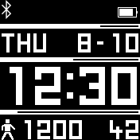
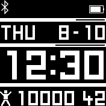
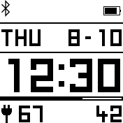
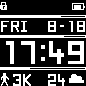

# Edge Clock

Tinxx presents you a clock with as many straight edges as possible to allow for a crisp look and perfect readability.
It comes with a custom font to display weekday, date, time, and steps. Also displays battery percentage while charging.  
There are three progress bars that indicate day of the week, time of the day, and daily step goal.
The watch face is monochrome and allows for applying your favorite color scheme.

The appearance is highly configurable. In the settings menu you can:
- De-/activate a buzz when the charger is connected while the watch face is active.
- Decide if month or day should be displayed first.
- Switch between 24h and 12h clock.
- Hide or display seconds.*
- Show AM/PM in place of the seconds.
- Show weather temperature and icon in place of the seconds.
- Set the daily step goal.
- En- or disable the individual progress bars.
- Set if your week should start with Monday or Sunday (for week progress bar).
- Toggle live step count updates.*

*) Hiding seconds and leaving live steps off should further reduce power consumption as the draw interval is prolonged as well.

The clock implements Fast Loading for faster switching to and fro.

## Contributors
 - [tinxx](https://github.com/tinxx)
 - [peerdavid](https://github.com/peerdavid)
 
