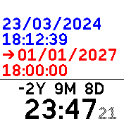
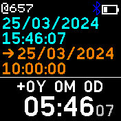
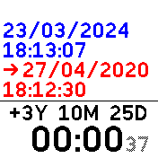
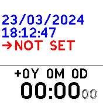

# Elapsed Time Clock
A clock that calculates the time difference between now (in blue/cyan) and any given target date (in red/orange).

The results is show in years, months, days, hours, minutes, seconds. The seconds can be shown:
- always
- when the watch is unlocked
- never.

The time difference is positive if the target date is in the past and negative if it is in the future.

# Settings
## Time and date formats:
- time can be shown in 24h or in AM/PM format
- date can be shown in DD/MM/YYYY, MM/DD/YYYY or YYYY-MM-DD format

## Display years and months
You can select if the difference is shown with years, months and days, or just days.

# TODO
- add the option to set an alarm to the target date
- add an offset to said alarm (e.g. x hours/days... before/after)

# Author

paul-arg [github](https://github.com/paul-arg)