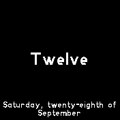
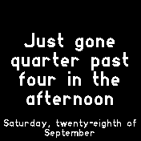
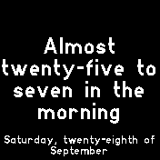

# Exact Words

This is a clock for expressing the time in exact words. Each minute of 
the day has a different phrase. 

Ranging form "Twelve" to "Coming up to midnight" to "A little after 
twenty-five past four in the early hours"

Screenshots best demonstrate 

## To Do

Add localisation. 

## Requests

Written by: [Brendan Sleight](https://github.com/bmsleight/) For support and discussion please post in the Bangle JS Forum

## Creator

[Brendan Sleight](https://github.com/bmsleight/) 
