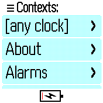
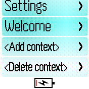
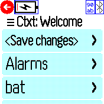
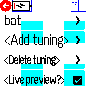
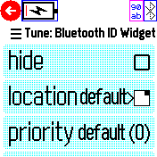
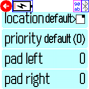

# F3 Widget Tuner

<b>F3 Widget Tuner</b> is an app for [Espruino Bangle.js 2](https://banglejs.com/)
wristwatches that allows one to tune the layout and visiblity of widgets,
with the tuning dependent on the current app showing on the watch.

<b>F3 Widget Tuner</b> also introduces some new features to widget layouts:
 * stable sort of widget order (e.g., order no longer depends on how widgets
   were installed onto the watch);
 * centering, padding, and hiding.

<b>F3 Widget Tuner</b> is brought to you by the
[FatFingerFederation](https://codeberg.org/FatFingerFederation/).

## Usage
<b>F3 Widget Tuner</b> takes over widget layout as soon as it is installed.
There is nothing to run; it operates as a bootscript that redefines
`Bangle.loadWidgets()` and `Bangle.drawWidgets()`.  To return to life
without <b>F3 Widget Tuner</b>, simply remove/uninstall it.

To configure its operation, look for <b>F3 Widget Tuner</b> in the Settings app:
```
    Settings -> Apps -> F3 Widget Tuner    
```

Configuration involves two steps:
 1. Create a _context_ to specify _when_ you want a set of tunings to take effect.
 2. Add _tunings_ to the context, to specify _how_ to tweak specific widgets.

### Context
A context is a collection of tunings.

Contexts are keyed by app; you create a context by specifying which app it
applies to.  There are three additional wildcard contexts you can create:
* `[any clock]` - applies only to clock apps
* `[any non-clock]` - applies to any app except for clocks
* `[any app]` - applies to any app at all

Only a single context will ever be in effect at any given time, and it will
always be the most specific context.  For example, suppose you have defined
contexts for _[any clock]_, _[any app]_, and _Anton Clock_.  Then, when
Anton Clock is running, only the _Anton Clock_ context will be in effect,
and only its tunings will be applied to your widgets.

There is no cascading of contexts; only the tunings defined in the most
specific applicable context will be applied to widgets.

### Tuning
A tuning is a set of parameter overrides keyed to a specific widget.

The tunable parameters are:
 * `hide`: hide the widget;
 * `location`: change which area of the screen the widget is rendered into;
 * `priority`: change the sorting order;
 * `pad left` and `pad right`: add positive/negative horizontal padding.

Every tuning must override at least one parameter; "empty" tunings are
simply removed from the context.

Hidden widgets are still drawn, so as not to interfere with any functionality
of the widget tied to its `draw()` call.  However, they are rendered offscreen
so they are invisible and do not affect the layout.

The `location` option allows overriding the widget's choice of rendering area,
and introduces "center" as a new option.  There are six widget areas to choose
from: {top, bottom} X {left, center, right}.


## Settings Menus

Note that some menu options only appear when they are applicable.  For example,
`<Delete context>` will only appear if there is a context to delete;
`<Save changes>` will only appear if there are changes to save.

### Top-level: `Contexts:`

... ... ...


* _list of existing contexts_:  click one to go to Edit Context menu
* `<Add context>`: click to go to Add Context menu
* `<Delete context>`: click to to go Delete Context menu

### Add Context: `Add context for:`
* _list of apps that do not yet have a context_

### Delete Context: `Delete context:`
* _list of existing contexts_

### Edit Context: `Ctxt: CONTEXT-NAME`

... ... ...


If _Live preview_ is enabled, the widgets will be outlined with blue
bounding boxes.  Zero-width widgets will be displayed as a vertical stripe.
Any padding applied to widgets will be outside the bounding boxes.

* `<Save changes>`: appears when there are unsaved changes to the context
* _list of widgets that have tunings_
* `<Add tuning>`
* `<Delete tuning>`
* `<Live preview?>`: checkbox to turn layout preview on/off

### Add Tuning: `Add tuning for:`
* _list of widgets that do not yet have a tuning_

### Delete Tuning: `Delete tuning:`
* _list of existing tunings_

### Edit Tuning: `Tune: WIDGET-NAME`

... ... ...


If _Live preview_ is enabled, the widget which is being tuned will be
highlighted in magenta (instead of blue).

* `hide`: remove the widget from the layout (in which case, the
  rest of the parameters will have no effect)
* `location`: zone in which widget will be place
* `priority`: override the priority for sorting; higher values come
  first in the layout
* `<Reset priority>`: reset priority to the widget's default; only
  appears if the priority is *not* set to the default
* `pad left`: add/remove pixels on left side of widget
* `pad right`: add/remove pixels on right side of widget

## Configuration Schema

For reference, the configuration for <b>F3 Widget Tuner</b> is stored
in `f3wdgttune.json`, and follows the following schema:
```
CONFIG = {"CONTEXT-KEY": CONTEXT,
          ...
          }

CONTEXT = {w: {"WIDGET-ID": TUNING,
               ...
               }}

TUNING = {hide: BOOL,       true = hide widget
          padl: INT,        left-padding
          padr: INT,        right-padding
          area: AREA-CODE,  rendering group
          order: INT        sorting ordinal
          }

AREA-CODE = one of "tl", "tc", "tr", "bl", "bc", "br"
          == {top, bottom} x {left, center, right}

CONTEXT-KEY = the app-filename of an app (e.g., 'antonclk.app.js'), OR
    one of "*", "*clk", "*!clk"

WIDGET-ID = a key in the WIDGETS object
```

* The order of elements generally does not matter to widget rendering.
  * However, the Settings UI keeps contexts and tunings sorted by
    app/widget name, to make it easier to show coherent, sorted lists
    to user.
* In `TUNING`, all elements are optional.  Absence of an element implies
  default behavior, i.e., no customization.  However, a `TUNING` must
  contain at least one element; empty `TUNING`s are not allowed.
* A `CONTEXT` without any `TUNING`s _is_ allowed.  An empty, more-specific
  context can be used to ignore the customizations of a more-general
  context.

Example:
```
{c: {"*": {w: {"widalarm": {padl: 6}
              }},
     "*clk": {w: {"widid": {hide: true},
                  "widbt": {area: "tl",
                            order: 10}
                 }},
     "about.app.js": {w: {}}
    }}
```

## Reporting Issues

Upstream development happens at
[FatFingerFederation/F3WidgetTuner](https://codeberg.org/FatFingerFederation/F3WidgetTuner);
please report any bugs/issues/etc there directly.

## Creator
- [Matt Marjanovic](https://codeberg.org/maddog)
