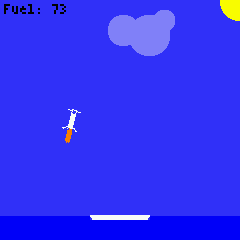
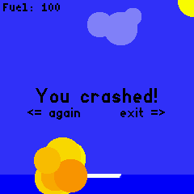
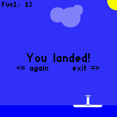

# F9 Lander

Land a Falcon 9 booster on a drone ship.

## Game play

Attempt to land your Falcon 9 booster on a drone ship before running out of fuel.
A successful landing requires:
 * setting down on the ship
 * the booster has to be mostly vertical
 * the landing speed cannot be too high

## Controls

The angle of the booster is controlled by tilting the watch side-to-side. The
throttle level is controlled by tilting the watch forward and back:
 * screen horizontal (face up) means no throttle
 * screen vertical corresponds to full throttle

The fuel burn rate is proportional to the throttle level.

## Creators
Liam Kl. B.

Marko Kl. B.

## Screenshots

