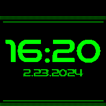

# Fallout Clock

Inspired by the aesthetic of the Fallout series, this clock face looks to emulate the color and feel of a PipBoy.

## Usage

You can also go into Settings, and choose it as the default clock under **Select Clock**.

## Planned Features:
- Display Steps as Health
- Display Heartrate
- Brighter Color when the backlight is not on.
- Configurable Settings

## Controls

Zero Settings, Zero Configuration. Install and add as your clockface.

## Requests

To request new features, add [an issue](https://github.com/zskelton/fallout_clock/issues).

## Creator

Zachary D. Skelton <zskelton@skeltonnetworks.com>\
[Skelton Networks](https://skeltonnetworks.com)\
[Github](https://github.com/zskelton)