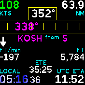

# Flight Dashboard

Shows basic flight and navigation instruments.

Basic flight data includes:

- Ground speed
- Track
- Altimeter
- VSI
- Local time

You can also set a destination to get nav guidance:

- Distance from destination
- Bearing to destination
- Estimated Time En-route (minutes and seconds)
- Estimated Time of Arrival (in UTC)

The speed/distance and altitude units are configurable.

Altitude data can be derived from GPS or the Bangle's barometer.

## DISCLAIMER

Remember to Aviate - Navigate - Communicate! Do NOT get distracted by your
gadgets, keep your eyes looking outside and do NOT rely on this app for actual
navigation!

## Usage

After installing the app, use the "interface" page (floppy disk icon) in the
App Loader to filter and upload a list of airports (to be used as navigation
destinations). Due to memory constraints, only up to about 500 airports can be
stored on the Bangle itself (recommended is around 100 - 150 airports max.).

Then, on the Bangle, access the Flight-Dash settings, either through the
Settings app (Settings -> Apps -> Flight-Dash) or a tap anywhere in the
Flight-Dash app itself. The following settings are available:

- **Nav Dest.**: Choose the navigation destination:
  - Nearest airports (from the uploaded list)
  - Search the uploaded list of airports
  - User waypoints (which can be set/edited through the settings)
  - Nearest airports (queried online through AVWX - requires Internet connection at the time)
- **Speed** and **Altitude**: Set the preferred units of measurements.
- **Use Baro**: If enabled, altitude information is derived from the Bangle's barometer (instead of using GPS altitude).

If the barometer is used for altitude information, the current QNH value is
also displayed. It can be adjusted by swiping up/down in the app.

To query the nearest airports online through AVWX, you have to install - and
configure - the [avwx](?id=avwx) module.

The app requires a text input method (to set user waypoint names, and search
for airports), and if not already installed will automatically install the
default "textinput" app as a dependency.

## Hint

Under the bearing "band", the current nav destination is displayed. Next to
that, you'll also find the cardinal direction you are approaching **from**.
This can be useful for inbound radio calls. Together with the distance, the
current altitude and the ETA, you have all the information required to make
radio calls like a pro!

## Author

Flaparoo [github](https://github.com/flaparoo)

