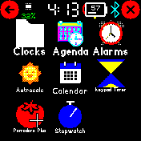
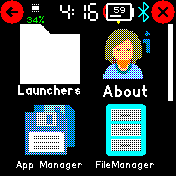

# Folder launcher

Launcher that allows you to put your apps into folders

## Launcher UI

The apps and folders will be presented in a grid layout, configurable in size. Tapping on a folder will open the folder. Folders can contain both apps and more folders. Tapping on an app will launch the app. If there is more than one page, there will be a scroll bar on the right side to indicate how far through the list you have scrolled. Folders will be displayed before apps, in the order that they were added. Apps will honor their sort order, if it exists.

Swiping up and down will scroll. Swiping from the left, using the back button, or pressing BTN1 will take you up a level to the folder containing the current one, or exit the launcher if you are at the top level.

## Settings menu

* Show clocks / Show launcher: Whether clock and launcher apps are displayed in the UI to be launched. The default is no.

* Disable vibration: Whether vibration is disabled in the launcher. The default is no.

* Hidden apps: Displays the list of installed apps, enabling them to be manually hidden. (Or unhidden, if hidden from here.) This may be convenient for apps that you have some other shortcut to access, or apps that are only shortcuts to an infrequently used settings menu. By default, no apps are hidden.

* Display:
    * Rows: The side length of the square grid. Lowest value is 1, no upper limit. The default is 2, but 3 is also convenient.
    * Show icons?: Whether app and folder icons are displayed. The default is yes.
    * Font size: How much height of each grid cell to allocate for the app or folder name. If size zero is selected, there will be no title for apps and folders will use a size of 12. (This is important because it is not possible to distinguish folders solely by icon.) The default is 12.

    To prevent the launcher from becoming unusable, if neither icons nor text are enabled in the settings menu, text will still be drawn.

* Timeout: If the launcher is left idle for too long, return to the clock. This is convenient if you often accidentally open the launcher without noticing. At zero seconds, the timeout is disabled. The default is 30 seconds.

* Folder management: Open the folder management menu for the root folder. (The folder first displayed when opening the launcher.) The folder management menu contains the following:
    * New subfolder: Open the keyboard to enter the name for a new subfolder to be created. If left blank or given the name of an existing subfolder, no folder is created. If a subfolder is created, open the folder management menu for the new folder.
    * Move app here: Display a list of apps. Selecting one moves it into the folder.
    * One menu entry for each subfolder, which opens the folder management menu for that subfolder.
    * View apps: Only present if this folder contains apps, Display a menu of all apps in the folder. This is for information only, tapping the apps does nothing.
    * Delete folder: Only present if not viewing the root folder. Delete the current folder and move all apps into the parent folder.

## Web interface

Limited editing is possible from the web interface. You can add folders and move applications between folders.