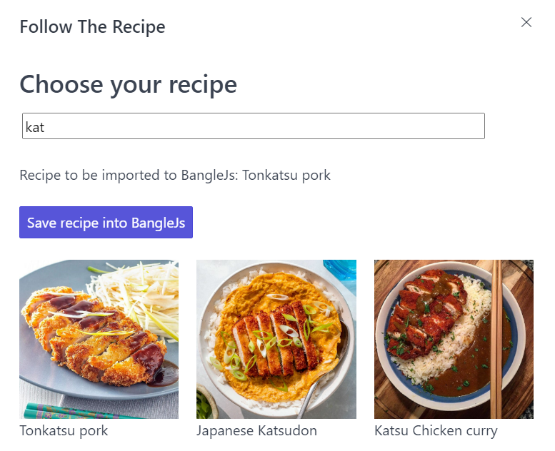

# Follow the recipe
A simple app using Gadgetbridge internet access to fetch a recipe and follow it step by step.

For now, if you are connected to Gadgetbridge, it display a random recipe whenever you restart the app.
Else, a stored recipe is displayed.
You can go to the next screen via tab right and go the previous screen via tab left.

You can choose a recipe via the App Loader:
Select the recipe then click on "Save recipe onto BangleJs".

Make sure that you allowed 'Internet Access' via the Gadgetbridge app before using Follow The Recipe.

If you run the app via web IDE, connect your Banglejs via Gadgetbridge app then in the web IDE connect via Android.
For more informations, [see the documentation about Gadgetbridge](https://www.espruino.com/Gadgetbridge)

TO-DOs:

- [X] Display random recipe on start
- [ ] Choose between some recipe previously saved or random on start
- [ ] Edit the recipe and save it to BangleJs
- [ ] improve GUI (color, fonts, ...)

## Contributors

Written by [Mel-Levesque](https://github.com/Mel-Levesque)

## Thanks To

- Design taken from the [Info application](https://github.com/espruino/BangleApps/tree/master/apps/info) by [David Peer](https://github.com/peerdavid)
- App icon from [icons8.com](https://icons8.com)
