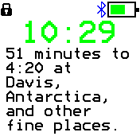
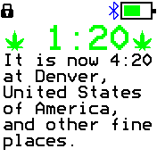

# Four Twenty Clock

A clock that tells when and where it's going to be [4:20](https://en.wikipedia.org/wiki/420_%28cannabis_culture%29) next

 

## Generating `fourTwentyTz.js`

Once in a while we need to regenerate it for 2 reasons:

* One or more places got in or out of daylight saving time (DST) mode.
* The database saying _when_ places enter/exit DST mode got updated.

I'll do my best to release a new version every time this happens,
but if you ever need to do this yourself, here's how:

* `cd` to the `ftclock` folder
* If you haven't done so yet, run `npm install` there (this would create the `node_modules` folder).
* Get and unzip the latest `timezone.csv.zip` from https://timezonedb.com/download
* Run `npm run make`

## Creator

[Nimrod Kerrett](zzzen.com)
