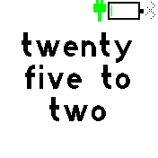
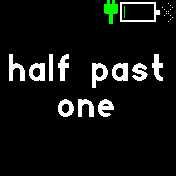

# Fuzzy Text Clock

An imprecise clock for when you're not in a rush.

This clock is a remake of one of my favourite Pebble watchfaces, Fuzzy Text International. I use this watch for weekends and holidays, when 'within 5 minutes of the actual time' is close enough!

Translations are supported to get the time in the language of your choice! To choose language, in the Bangle App Loader, navigate to the 'More...' tab and pick language under 'Settings'. Currently supported languages are below, but if you want to contribution a translation please feel free!:
*  en_GB - English (Default)
*  es_ES - Spanish
*  fr_FR - French
*  nn_NO - Norwegian Nynorsk (thank you zerodogg)
*  sv_SE - Swedish
*  de_DE - German
*  da_DK - Danish

Most translations are taken from the original Fuzzy Text International code.

## TODO
* Bold hour word (as the pebble version has)

## References
Based on Pebble app Fuzzy Text International: https://github.com/hallettj/Fuzzy-Text-International

