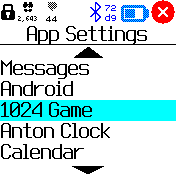
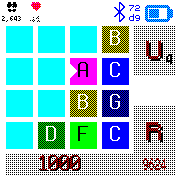

# Play the game of 1024

Move the tiles by swiping left, right, up- or downward over the watchface.

When two tiles with the same number are squashed together they will add up as exponentials:

**1 + 1 = 2** or **A + A = D**  which is a representation of  **2^1 + 2^1 = 2^1 = 4**

**2 + 2 = 3** or **B + B = C**  which is a representation of  **2^2 + 2^2 = 2^3 = 8**

**3 + 3 = 4** or **C + C = D** which is a representation of  **2^3 +  2^3 = 2^4 = 16**

After each move a new tile will be added on a random empty square. The value can be 1 or 2, and will be marked with a chevron.

So you can continue till you reach **1024** which equals **2^(10)**. So when you reach tile **10** you have won.

The score is maintained by adding the outcome of the sum of all pairs of squashed tiles (4+16+4+8 etc.)

Use the side **BTN** to exit the game, score and tile positions will be saved.

## Buttons on the screen

 - Button **U**: Undo the last move. There are currently a maximum of 9 undo levels. The level is indicated with a small number in the lower righthand corner of the Undo button
    - You can set the maximum undo level in the Apps settings menu.
 
 - Button **R**: Reset the game. The Highscore will be remembered. You will be prompted first. 
    - The highscore value can be reset in the Apps settings menu.

    Apps setting: 

 - Stuff you can change in de 1024 Game settings:
    - Symbols on the cells: numerical, alphabetical or Roman
    - Undo levels [0-9]
    - Exit: how to exit the game: long or short press
    - Debug mode: on or off. This will log all kinds of stuff in the console of the Web IDE
    - Reset Highsccore: Tired of looking at the old highscore? Now you can set it to 0 again.

### Credits

Game 1024 is based on Saming's 2048 and Misho M. Petkovic 1024game.org and conceptually similar to Threes by Asher Vollmer.

In Dark theme with numbers:

In Light theme with characters:

