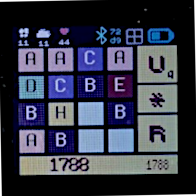

# Play the game of 1024

Move the tiles by swiping to the lefthand, righthand or up- and downward side of the watch.

When two tiles with the same number are squashed together they will add up as exponentials:

**1 + 1 = 2** or **A + A = D**  which is a representation of  **2¹ + 2¹ = 2² = 4**

**2 + 2 = 3** or **B + B = C**  which is a representation of  **2² + 2² = 2³ = 8**

**3 + 3 = 4** or **C + C = D** which is a representation of  **2³ +  2³ = 2⁴ = 16**

So you can continue till you reach **1024** which equals **2¹⁰**. So when you reach tile **10** you have won.

The score is maintained by adding the outcome of the sum of all pairs of squashed tiles (4+16+4+8 etc.)

## Buttons

 - Button **U**: Undo the last move. There are currently a maximum of 4 undo levels
 - Button **\***:  Change the text on the tile to number, capitals or Roman numbers
 - Button **R**: Reset the game. The Higscore will be remembered. You will be prompted first.

### Credits

Game 1024 is based on Saming's 2048 and Misho M. Petković 1024game.org and conceptually similar to Threes by Asher Vollmer.

