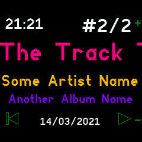

# Gadgetbridge Music Controls

If you have an Android phone with Gadgetbridge, this app allows you to view
and control music playback.

 

Download the [latest Gadgetbridge for Android here](https://f-droid.org/packages/nodomain.freeyourgadget.gadgetbridge/).

## Features

* Dynamic colors based on Track/Artist/Album name
* Scrolling display for long titles
* Automatic start when music plays
* Time and date display

## Settings

You can change these under `Settings`->`App/Widget Settings`->`Music Controls`.

**Auto start**: 
Automatically load the app when you play music and close when the music stops.
(If the app opened automatically, it closes after music has been paused for 5 minutes.)

**Simple button**:
Disable double/triple pressing Button 2: always simply toggle play/pause.
(For music players which handle multiple button presses themselves.)

## Controls

### Buttons
* Button 1: Volume up
* Button 2: 
  - Single press: toggle play/pause 
  - Double press: next song
  - Triple press: previous song
  - Long-press: open application launcher 
* Button 3: Volume down

### Touch
* Left: pause/previous song
* Right: next song/resume
* Center: toggle play/pause
* Swipe: next/previous song

## Creator

Richard de Boer <rigrig+banglejs@tubul.net>
