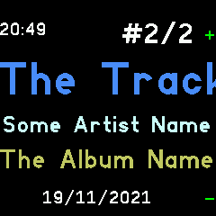
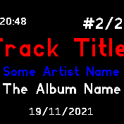
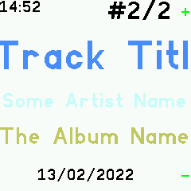
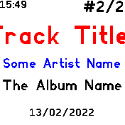

# Gadgetbridge Music Controls

If you have an Android phone with Gadgetbridge, this app allows you to view
and control music playback.

| Bangle.js 1                                              | Bangle.js 2                                              |
|:---------------------------------------------------------|:---------------------------------------------------------|
|   |   |
|  |  |

Download the [latest Gadgetbridge for Android here](https://f-droid.org/packages/nodomain.freeyourgadget.gadgetbridge/).

## Features

* Dynamic colors based on Track/Artist/Album name
* Scrolling display for long titles
* Automatic start when music plays

## Settings

You can change these under `Settings`->`App/Widget Settings`->`Music Controls`.

**Auto start**: 
Automatically load the app when you play music and close when the music stops.
(If the app opened automatically, it closes after music has been paused for 5 minutes.)

**Simple button**:
Disable double/triple pressing Middle Button: always simply toggle play/pause.
(For music players which handle multiple button presses themselves.)

## Controls

### Buttons
* Button 1 (*Bangle.js 1*): Volume up
* Middle Button: 
  - Single press: Toggle play/pause 
  - Double press: Next song
  - Triple press: Previous song
  - Long-press: open application launcher 
* Button 3 (*Bangle.js 1*): Volume down

### Touch
* Touch: Toggle play/pause
* Swipe left/right: Next/previous song
* Swipe up/down (*Bangle.js 2*): Volume up/down

## Creator

Richard de Boer <rigrig+banglejs@tubul.net>
