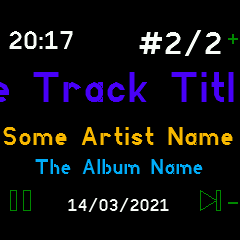

# Gadgetbridge Music Controls

If you have an Android phone with Gadgetbridge, this app allows you to view
and control music playback.

 

Download the [latest Gadgetbridge for Android here](https://f-droid.org/packages/nodomain.freeyourgadget.gadgetbridge/).

## Features

* Dynamic colors based on Track/Artist/Album name
* Scrolling display for long titles
* Automatic start when music plays
* Time and date display

## Settings

The app can automatically load when you play music and close when the music stops.
You can change this under `Settings`->`App/Widget Settings`->`Music Controls`.
(If the app opened automatically, it closes after music has been paused for 5 minutes.)

## Controls

### Buttons
* Button 1: Volume up (hold to repeat)
* Button 2: Toggle play/pause, long-press for menu
* Button 3: Volume down (hold to repeat, but remember that holding for too long resets your watch)

### Touch
* Left: pause/previous song
* Right: next song/resume
* Center: toggle play/pause
* Swipe: next/previous song

## Creator

Richard de Boer <rigrig+banglejs@tubul.net>
