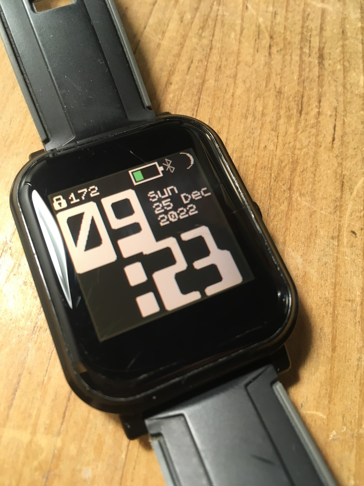

# Gemini clock

A simple clock face using the Buro Destruct Geminis font, inspired by their Pebble Watch designs: https://burodestruct.net/work/pebble-watchfaces

It is designed for maximum legibility and utility whilst still showing widgets.

If editing or remixing this code, please retain leading zeroes on the hours, they are an integral part of the design.

The minutes are not right-aligned deliberately so that the numbers don't jump around too much when they change.

## Creator
Created by Giles Booth:
- http://www.suppertime.co.uk/blogmywiki/
- https://mastodon.social/@blogmywiki
- https://github.com/blogmywiki

