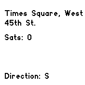
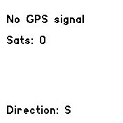

# Get Address App
This app uses the GPS and compass capabilities of the Bangle.js 2 watch to display your current location and direction.

The app uses the Nominatim API to reverse geocode your location and display the street and house number. It also uses the compass to display your current direction.

## Screenshots

## Requirements
To run this app, you will need to meet the following requirements:

1. Android Integration app or iOS integration app must be installed.
2. In Bangle.js Gadgetbridge connect the watch, then navigate to the **Gear icon** and enable "Use GPS data from phone".
3. In the same settings dialog scroll down and enable "Allow internet access".
4. Under **System** > **Settings** > **General Settings**, press "Get location" once and wait until it finds a location
5. In the same settings dialog enable "Keep location up to date".
7. The watch must have a clear view of the sky to receive GPS signals.
8. The compass must be calibrated by moving the watch in a figure-eight motion.

Note: This app requires an active internet connection to function. It uses the Nominatim API to reverse geocode your location, and it may not work in areas with limited or no internet connectivity.

by [Online Speech to Text Cloud](https://www.speech-to-text.cloud/)
