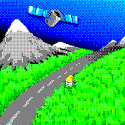
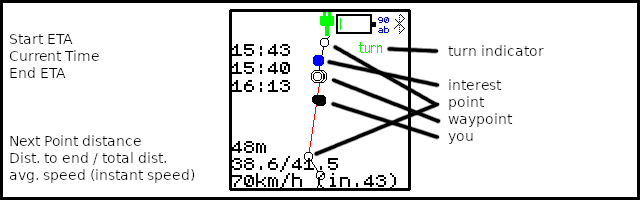
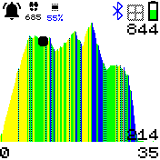

# Gipy

Gipy allows you to follow gpx traces on your watch.

It is mainly meant for bicycling but hiking might be fine.

It is untested on Banglejs1. If you can try it, you would be welcome.

This software is not perfect but surprisingly useful.

## Features

It provides the following features :

- display the path with current position from gps
- display a local map around you, downloaded from openstreetmap
- detects and buzzes if you leave the path
- (optional) buzzes before waypoints
(for example when you need to turn in https://mapstogpx.com/)
- display instant / average speed
- display distance to next point
- display additional data from openstreetmap :
    - water points
    - toilets
    - artwork
    - bakeries
- display elevation data if available in the trace

## Usage

### Preparing the file

You typically want to use a trace file in *gpx* format.
Usually I download from [komoot](https://www.komoot.com/) or I export
from google maps using [mapstogpx](https://mapstogpx.com/). [Brouter](https://brouter.damsy.net) is
also a nice open source option.

Note that *mapstogpx* has a super nice feature in its advanced settings.
You can turn on 'next turn info' and be warned by the watch when you need to turn.

Once you have your gpx file you need to convert it to *gps* which is my custom file format.
They are smaller than gpx and reduce the number of computations left to be done on the watch.

Just click the disk icon and select your gpx file.
This will request additional information from openstreetmap.
Your path will be displayed in svg.

Note that it is also possible to just hit the shift key and drag the mouse on the map
to download a map (with no trace). If you want a map, hitting the "ski" checkbox
before selecting the area will parse openstreetmap data in order to get the pistes and
the lifts. Colors will correspond to difficulty levels.

### Starting Gipy

At start you will have a menu for selecting your trace (if more than one).
Choose the one you want and you will reach the splash screen where you'll wait for the map.
Once the map is loaded you will reach the main screen:

The screen is oriented so that the top of the image is in front of you.
It will rotate as you turn.
On your screen you can see:

- yourself (the big black dot)
- the path (thick red line)
- a green arrow telling you which way is forward
- if needed a projection of yourself on the path (small black dot)
- waypoints as large white dots
- some text on the left (from top to bottom):
    * current time
    * time to reach end point at current average speed
    * left distance till end of current segment
    * remaining distance / path length
    * average speed / instant speed
- interest points from openstreetmap as color dots :
    * red: bakery
    * deep blue: water point
    * cyan: toilets (often doubles as water point)
    * green: artwork
- a *turn* indicator on the top right when you reach a turning point
- a *gps* indicator (blinking) on the top right if you lose gps signal

### Lost

If you stray away from path we will display the direction to follow as a purple segment. Your main position will also turn to purple.

Note that while lost, the app will slow down a lot since it will start scanning all possible points to figure out where you
are. On path it just needed to scan a few points ahead and behind.

The distance to next point displayed corresponds to the length of the purple segment.

### Menu

If you click the button you'll reach a menu where you can currently zoom out to see more of the map
(with a slower refresh rate), reverse the path direction and disable power saving (keeping backlight on).

### Elevation

If you touch the screen you will switch between display modes.
The first one displays the map, the second one the nearby elevation and the last one the elevation
for the whole path.

Colors correspond to slopes.
Above 15% will be red, above 8% orange, above 3% yellow, between 3% and -3% is green and shades of blue
are for descents.

You should note that the precision is not very good. The input data is not very precise and you only get the
slopes between path points. Don't expect to see small bumps on the road.

### Settings

Few settings for now (feel free to suggest me more) :

- buzz on turns : should the watch buzz when reaching a waypoint ?
- disable bluetooth : turn bluetooth off completely to try to save some power.
- lost distance : at which distance from path are you considered to be lost ?
- wake-up speed : if you drive below this speed powersaving will disable itself
- active-time : how long (in seconds) the screen should be turned on if activated before going back to sleep.
- brightness : how bright should screen be ? (by default 0.5, again saving power)
- power lcd off (disabled by default): turn lcd off when inactive to save power. the watch will wake up when reaching points,
when you touch the screen and when speed is below 13km/h.
- powersave by default: when gipy starts is powersaving activated ? (see below)
- sleep between waypoints: instead of powersaving between points save power between waypoints (crossroads). this way you can save more. waypoints autodetection is WIP.

### Powersaving

Starting with release 0.20 we experiment with power saving.

By default, powersaving is **disabled**. You can turn it on in the menu by checking the powersaving box.
You can also change the default choice in the app settings (*powersave by default* setting).

There are now two display modes :

- active : the screen is lit back (default at 50% light but can be configured with the *brightness* setting)
- inactive : by default the screen is not lit but you can also power it off completely (with the *power lcd off* setting)

The algorithm works in the following ways :

- some events will *activate* : the display will turn *active*
- if no activation event occur for at least 10 seconds (or *active-time* setting) we switch back to *inactive*

Activation events are the following :

- you are near (< 100m) the next point (only waypoints of *sleep between waypoints* is on) on path
- you are slow (< *wake-up speed* setting (13 km/h by default))
- you are lost
- you press the button / touch the screen

Power saving has been tested on a very long trip with several benefits

- longer battery life
- waking up near path points will attract your attention more easily when needed

### Caveats

It is good to use but you should know :

- the gps might take a long time to start initially (see the assisted gps update app).
- gps signal is noisy : there is therefore a small delay for instant speed. sometimes you may jump somewhere else.
- if you adventure in gorges the gps signal will become garbage.
- your gpx trace has been decimated and approximated : the **REAL PATH** might be **A FEW METERS AWAY**
- sometimes the watch will tell you that you are lost but you are in fact on the path. It usually figures again
the real gps position after a few minutes. It usually happens when the signal is acquired very fast.
- buzzing does not always work: when there is a high load on the watch, the buzzes might just never happen :-(.
- buzzes are not strong enough to be always easily noticed.
- be careful when **GOING DOWNHILL AT VERY HIGH SPEED**. I already missed a few turning points and by the time I realized it,
I had to go back uphill by quite a distance.

## Creator

Feel free to give me feedback : is it useful for you ? what other features would you like ?

If you want to raise issues the main repository is [here](https://github.com/wagnerf42/BangleApps) and
the rust code doing the actual map computations is located [here](https://github.com/wagnerf42/gps).
You can try the cutting edge version at [https://wagnerf42.github.io/BangleApps/](https://wagnerf42.github.io/BangleApps/)

frederic.wagner@imag.fr
