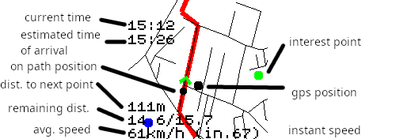
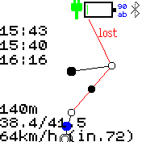

# Gipy

Gipy allows you to follow gpx traces on your watch.

It is mainly meant for bicycling but hiking might be fine.

It is untested on Banglejs1. If you can try it, you would be welcome.

This software is not perfect but surprisingly useful.

## Features

It provides the following features :

- display the path with current position from gps
- detects and buzzes if you leave the path
- buzzes before sharp turns
- buzzes before waypoints 
(for example when you need to turn in https://mapstogpx.com/)
- display instant / average speed
- display distance to next point
- display additional data from openstreetmap :
    - water points
    - toilets
    - artwork
    - bakeries

optionally it can also:

- try to turn off gps between crossroads to save battery

## Usage

### Preparing the file

You first need to have a trace file in *gpx* format.
Usually I download from [komoot](https://www.komoot.com/) or I export
from google maps using [mapstogpx](https://mapstogpx.com/).

Note that *mapstogpx* has a super nice feature in its advanced settings.
You can turn on 'next turn info' and be warned by the watch when you need to turn.

Once you have your gpx file you need to convert it to *gpc* which is my custom file format.
They are smaller than gpx and reduce the number of computations left to be done on the watch.

Just click the disk icon and select your gpx file.
This will request additional information from openstreetmap.
Your path will be displayed in svg.

### Starting Gipy

At start you will have a menu for selecting your trace (if more than one).
Choose the one you want and you will reach the splash screen where you'll wait for the gps signal.
Once you have a signal you will reach the main screen:

On your screen you can see:

- yourself (the big black dot)
- the path (the top of the screen is in front of you)
- on the path, current and next segments are red and other ones are black
- if needed a projection of yourself on the path (small black dot)
- points as white dots
- waypoints as doubled white dots
- some text on the left (from top to bottom):
    * time to reach start point at current average speed
    * current time
    * time to reach end point at current average speed
    * left distance till end of current segment
    * remaining distance / path length
    * average speed / instant speed
- interest points from openstreetmap as color dots :
    * red: bakery
    * deep blue: water point
    * cyan: toilets (often doubles as water point)
    * green: artwork
- a *turn* indicator on the top right when you reach a turning point
- a *gps* indicator (blinking) on the top right if you lose gps signal
- a *lost* indicator on the top right if you stray too far away from path

### Lost

If you stray away from path we will rescale the display to continue displaying nearby segments and
display the direction to follow as a black segment.

Note that while lost, the app will slow down a lot since it will start scanning all possible points to figure out where you
are. On path it just needed to scan a few points ahead and behind.

The distance to next point displayed corresponds to the length of the black segment.

### Settings

Few settings for now (feel free to suggest me more) :

- keep gps alive : if turned off, will try to save battery by turning the gps off on long segments
- max speed : used to compute how long to turn the gps off
- display points : display/hide points (not waypoints)

### Caveats

It is good to use but you should know :

- the gps might take a long time to start initially (see the assisted gps update app).
- gps signal is noisy : there is therefore a small delay for instant speed. sometimes you may jump somewhere else.
- your gpx trace has been decimated and approximated : the **REAL PATH** might be **A FEW METERS AWAY**
- sometimes the watch will tell you that you are lost but you are in fact on the path.
- battery saving by turning off gps is not very well tested (disabled by default).
- buzzing does not always work: when there is a high load on the watch, the buzzes might just never happen :-(.
- buzzes are not strong enough to be always easily noticed.
- be careful when **GOING DOWNHILL AT VERY HIGH SPEED**. I already missed a few turning points and by the time I realized it,
I had to go back uphill by quite a distance.

## Creator

Feel free to give me feedback : is it useful for you ? what other features would you like ?

frederic.wagner@imag.fr
