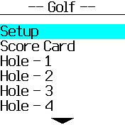
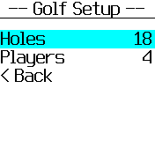
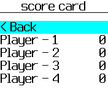
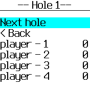

# Golf Score

Lets you keep track of strokes during a game of Golf.

## Usage

1. Open the app,
1. scroll to setup
1. set the number of holes (18 by default, but can be configured)
1. set the number of players (4 by default, but can be 1-20)
1. click back
1. scroll to a hole (hole 1)
1. scroll to a player and set the number of strokes they took (repeat as needed)
1. click next hole and repeat #6 and #7 as needed; or click back
1. at any time, check the score card for a sum total of all the strokes for each player

## Features

Track strokes for multiple players (1-20)
Set number of holes on course

## Controls

N/A

## Requests

Michael Salaverry (github.com/barakplasma)

## Creator

Michael Salaverry
