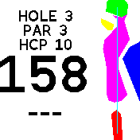

# Golf View

This app leverages open source map data to give you a birds eye view of your golf game! See a preview of any hole as well as your realtime distance to the green and position on the hole.

## Usage

Swipe left and right to select your hole. Use the GPS assist app to get a faster GPS fix.

## Contributions

The performance of this app depends on the accuracy and consistency of user-submitted maps.

- See official mapping guidelines [here](https://wiki.openstreetmap.org/wiki/Tag:leisure%3Dgolf_course).
- All holes and features must be within the target course's area.
- Supported features are greens, fairways, tees, bunkers, water hazards and holes.
- All features for a given hole should have the "ref" tag with the hole number as value. Shared features should list ref values separated by ';'. [example](https://www.openstreetmap.org/way/36896320).
- here must be 18 holes and they must have the following tags: handicap, par, ref, dist.
- For any mapping assistance or issues, please file in the <a href="https://github.com/espruino/BangleApps/issues/new?assignees=&labels=bug&template=bangle-bug-report-custom-form.yaml&title=[golfview]+Short+description+of+bug">official repo</a>.

[Example Course](https://www.openstreetmap.org/way/25447898)
## Controls

Swipe to change holes and tap to see a green closeup.

## Requests/Creator

[Jason Dekarske](https://github.com/jdekarske)

## Attribution

[© OpenStreetMap contributors](https://www.openstreetmap.org/copyright)
