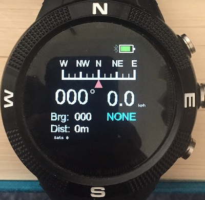
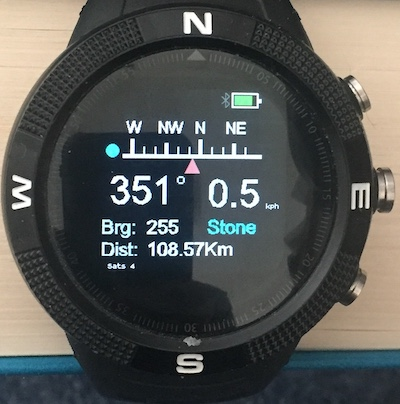
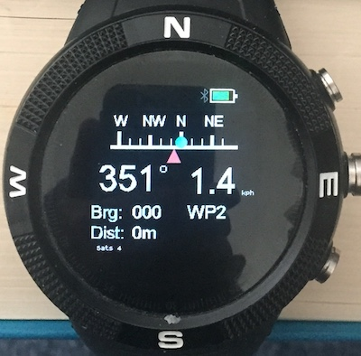
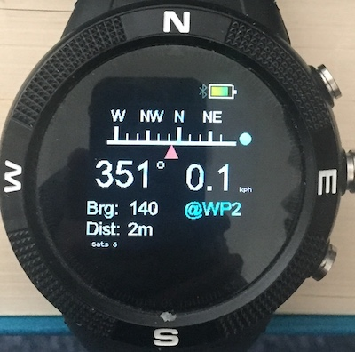

## gpsnav - navigate to waypoints

The app is aimed at small boat navigation although it can also be used to mark the location of your car, bicycle etc and then get directions back to it. Please note that it would be foolish in the extreme to rely on this as your only boat navigation aid!

The app displays direction of travel (course), speed, direction to waypoint (bearing) and distance to waypoint. The screen shot below is before the app has got a GPS fix.

The large digits are the course and speed. The top of the display is a linear compass which displays the direction of travel when a fix is received and you are moving. The blue text is the name of the current waypoint. NONE means that there is no waypoint set and so bearing and distance will remain at 0. To select a waypoint, press BTN2 (middle) and wait for the blue text to turn white. Then use BTN1 and BTN3 to select a waypoint. The waypoint choice is fixed by pressing BTN2 again. In the screen shot below a waypoint giving the location of Stone Henge has been selected.

The display shows that Stone Henge is 108.75Km from the location where I made the screenshot and the direction is 255 degrees - approximately west. The display shows that I am currently moving approximately north - albeit slowly!. The position of the blue circle indicates that I need to turn left to get on course to Stone Henge. When the circle and red triangle line up you are on course and course will equal bearing.

### Marking Waypoints

The app lets you mark your current location as follows. There are vacant slots in the waypoint file which can be allocated a location. In the distributed waypoint file these are labelled WP0 to WP4. Select one of these - WP2 is shown below.

Bearing and distance are both zero as WP1 has currently no GPS location associated with it. To mark the location, press BTN2.

The app indicates that WP2 is now marked by adding the prefix @ to it's name. The distance should be small as shown in the screen shot as you have just marked your current location.

### Waypoint JSON file

When the app is loaded from the app loader, a file named waypoints.json is loaded along with the javascript etc. The file has the following contents:

~~~
[
  {
  "mark":0,
  "name":"NONE"
  },
  {
  "mark":1,
  "name":"No10",
  "lat":51.5032,
  "lon":-0.1269
  },
  {
  "mark":1,
  "name":"Stone",
  "lat":51.1788,
  "lon":-1.8260
  },
  { "name":"WP0" },
  { "name":"WP1" },
  { "name":"WP2" },
  { "name":"WP3" },
  { "name":"WP4" }
]
~~~

The file contains the initial NONE waypoint which is useful if you just want to display course and speed. The next two entries are waypoints to No 10 Downing Street and to Stone Henge - obtained from Google Maps. The last five entries are entries which can be *marked*.

You add and delete entries using the Web IDE to load and then save the file from and to watch storage. The app itself does not limit the number of entries although it does load the entire file into RAM which will obviously limit this. 

I plan to release an accompanying watch app to edit waypoint files in the near future and a way to download your own waypoint file using the app loader.

