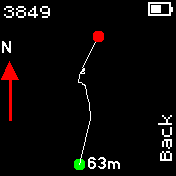

# GPS Recorder

This app allows you to record a GPS track. It can run in background. The data can later be exported as KML or GPX files via the BangleJS app store.

## Tips

When you turn on recording, a widget badge that looks like a satellite will appear immediately at the top of the screen. However, the recording does not begin immediately. It usually takes several minutes for the watch to get a [GPS fix](https://en.wikipedia.org/wiki/Time_to_first_fix). You will notice a blinking question mark at the lower left of the badge indicating currently getting a fix. The badge will change when a GPS fix is achieved and that is when the app actually starts writing data to the log file. You can [upload assistant files](https://banglejs.com/apps/#assisted%20gps%20update) to speed up the time spent on getting a GPS fix.

## Viewing a track

