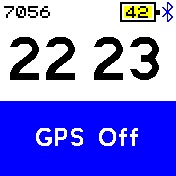
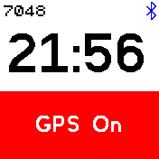
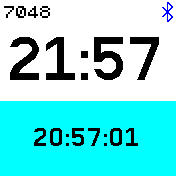
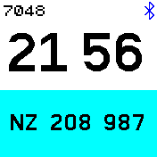

# GPS Touch

- A touch controlled GPS watch for Bangle JS 2
- Key feature is the conversion of Lat/Lon into Ordinance Servey Grid Reference
- Swipe left and right to change the display
- Select GPS and switch the GPS On or Off by touching twice in the top half of the display
- Select LOGGER and switch the GPS Recorder On or Off by touching twice in the top half of the display
- Displays the GPS time in the bottom half of the screen when the GPS is powered on, otherwise 00:00:00 
- Select display of Course, Speed, Altitude, Longitude, Latitude, Ordinance Servey Grid Reference

## Screenshots

Written by: [Hugh Barney](https://github.com/hughbarney)  For support and discussion please post in the [Bangle JS Forum](http://forum.espruino.com/microcosms/1424/)
