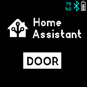
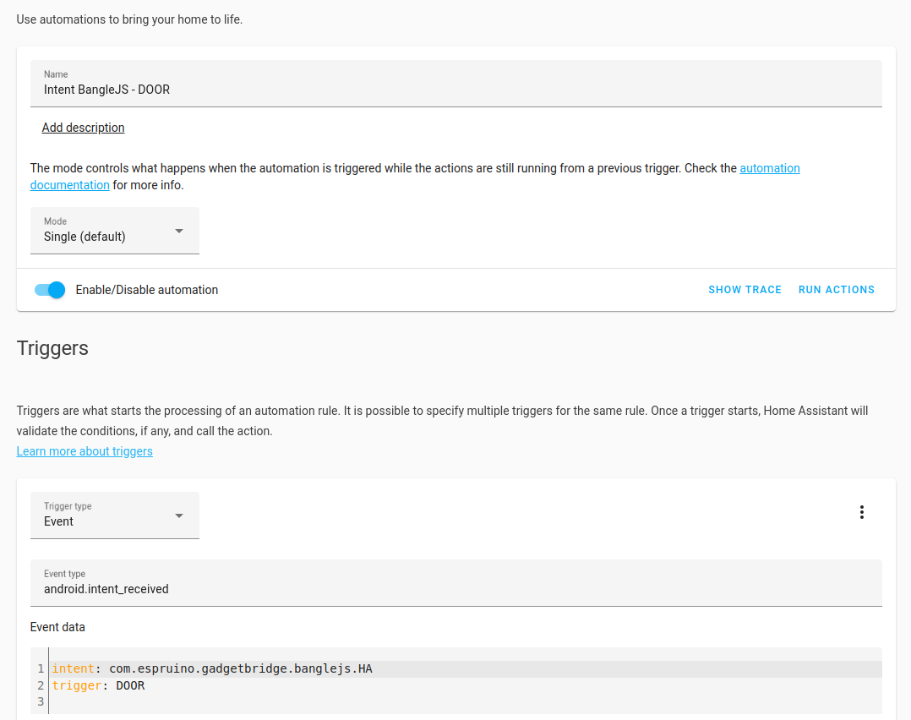

# Home Assistant
This app integrates your Bangle.js into the Home Assistant.


# How to use
Click on the left or right side of the screen to select the triggers that you configured.
Swiping left or right works as well.

Click in the middle of the screen to send the trigger to Home Assistant via Gadgetbridge.

If the trigger is a value one (has `.value = true` in the config), a slider will be displayed for you to alter the value that's sent along with the trigger.




# Initial Setup
1.) First of all, make sure that Home Assistant and the Home Assistant Android Companion App work.

2.) Open your Bangle.js Gadgetbridge App, click on the Settings icon of your Bangle.js and enable "Allow Intent Access"

3.) Enable sensor in Home Assistant Android App/Configuration/Companion App/Manage Sensors/LastUpdate Trigger

4.) At the bottom of the same screen click on "Add New Intent" and enter "com.espruino.gadgetbridge.banglejs.HA"

5.) The Home Assistant Android app must be restarted in order to listen for those actions
 -- a "Force Stop" is necessary (through Android App settings) or restart your phone!

This setup must be done only once -- now you are ready to configure your BangleJS to
control some devices or entities in your Home Assistant :)


# Setup Trigger
1.) Upload the app and all corresponding triggers through the AppStore UI. You must specify
the display name, the trigger as well as an icon.
The following icons are currently supported:
- ha (default)
- light
- door
- fire


2.) Create an "automation" in the Home Assistant WebUI for each trigger that you created on your Bangle.js in order to tell Home Assistant what you want to control. A sample configuration is shown in the image below -- I use this trigger to open the door:



3.) Don't forget to select the action that should be executed at the bottom of each automation.


# Default Trigger
This app also implements two default trigger that can always be used:
- APP_STARTED -- Will be sent whenever the app is started. So you could do some actions already when the app is sarted without the need of any user interaction.
- TRIGGER -- Will be sent whenever some trigger is executed. So you could generically listen to that.


# How to use the library (ha.lib.js) in my own app/clock
This app inlcludes a library that can be used by other apps or clocks
to read all configured intents or to send a trigger. Example code:

```js
// First of all impport the library
var ha = require("ha.lib.js");

// You can read all triggers that a user configured simply via
var triggers = ha.getTriggers();

// Get display name and icon of trigger
var display = triggers[0].display;
var icon = triggers[0].getIcon();

// Trigger the first configured trigger
ha.sendTrigger(triggers[0].trigger);

// Send a custom trigger that is not configured by a user
ha.sendTrigger("MY_CUSTOM_TRIGGER");
```


# FAQ

## Sometimes the trigger is not executed
While playing and testing a bit I found that it is very important that you allow the android Home Assistant app, as well as Bangle.js Gadgetbridge app to (1) run in background and (2), disable energy optimizations for both apps.
Otherwise, Android could stop one of both apps and the trigger will never be sent to Home Assistant...

If you still have problems, you can try another trick:
Install "MacroDroid" from the Android AppStore and start the Home Assistant App
each time the "com.espruino.gadgetbridge.banglejs.HA" intent is send together
with the extra trigger: APP_STARTED. Then whenever you open the app on your Bangle.js
it is ensured that Home Assistant is running...

## Thanks to
<a href="https://www.flaticon.com/free-icons/" title="Icons">Icons created by Flaticon</a>

## Creator
- [David Peer](https://github.com/peerdavid).

## Contributor
- [myxor](https://github.com/myxor)
