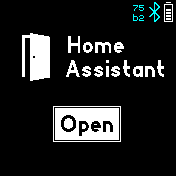

# Home Assistant
This app integrates your BangleJs into the HomeAssistant.

# How to use
Click on the left and right side of the screen to select the triggers that you
configured. Click in the middle of the screen to send the trigger to HomeAssistant.

# First Setup
1.) First of all, make sure that HomeAssistant and the HomeAssistant Android App works.

2.) Open your BangleJs Gadgetbridge App, click on the Settings icon of your BangleJs and enable "Allow Intent Access"

3.) Enable sensor in HomeAssistant Andoird App/Configuration/Companion App/Manage Sensors/LastUpdate Trigger

4.) At the bottom of the same screen click on "Add New Intent" and enter "com.espruino.gadgetbridge.banglejs.HA"

5.) The HomeAssistant Android app must be restarted in order to listen for those actions
 -- a "Force Stop" is necessary (through Android App settings) or restart your phone!

This setup must be done only once -- now you are ready to configure your BangleJS to
control some devices or entities in your HomeAssistant :)

# Setup Trigger
1.) Upload the app and all corresponding triggers through the AppStore UI. For example I entered "DOOR,LIGHT,OVEN". The list will be shown in your BangleJs in the corresponding order so enter more important triggers first.

2.) Create an "automation" in the HomeAssistant WebUI for each trigger that you created on your BangleJs in order to tell HomeAssistant what you want to control. A sample configuration is shown in the image below -- I use this trigger to open the door:

3.) Don't forget to select the action that should be executed at the bottom of each automation.

*Note: There is also an automatic trigger send when the app is started (APP_STARTED) -- so you could
add an action also for that.*

# FAQ

## Sometimes the trigger is not executed
While playing and testing a bit I found that it is very important that you allow the android HomeAssistant app, as well as BangleJs Gadgetbridge app to (1) run in background and (2), disable energy optimizations for both apps.
Otherwise, Android could stop one of both apps and the trigger will never be sent to HomeAssistant...

## Creator
- [David Peer](https://github.com/peerdavid).
