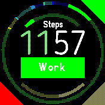
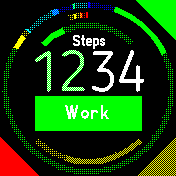

# Time Harvester 

>Digital clock with large segmented ring gauges to show accumulated fruitful time 
>spent by category, and “fallow” rest time available, as well as over-rested time

The concept of this clock is to give an always-visible summary of the fruitfulness 
of your day so far in a few broad categories, as well as time spent in balanced 
or excessive rest. At any moment, it’s accumulating time spent in one category or 
another, whether one of the configured fruitful categories, [centering/self-limiting 
rest](https://intend.do/articles/centering-distractions-are-good-for-focus), or 
divergent distraction. Fruitful time also accumulates a buffer 
of some fraction (1/3 by default) for later resting, which can be spent as you 
see fit (like Pomodoro, but more flexible). Running out of this “fallow” buffer 
while doing something centering just leaves it empty (so you can eat a meal or 
go to sleep), but running out while doing something divergent will count up the 
deficit and show a red gauge segment for the total.

The outer ring shows fruitful categories, with dimmed colors filling out segments 
for the targets you haven’t yet reached. (There are six fruitful categories below.)

If you surpass a target for a particular fruitful category, or you run over the 
fallow buffer in a divergent mode, those will appear in a ring inside the outer 
one, starting from the top center and going clockwise for fruitful, and 
counter-clockwise for divergent. These have no fixed duration and will be run 
together with small dim margins between. (Below, you can see a few minutes in 
each of three divergent categories I set up.)

Switch modes by using the three corner buttons. If you realize you should have 
switched sooner, tap the correct button again and scroll through the menu if 
needed to find the last option, `(Fix start...)`. This will let you select the 
number of minutes to retroactively move from the previous mode to the current,
if there’s a way to make that work.

The clock will buzz with increasing urgency as you run down the fallow buffer in 
a divergent mode, and also every few minutes after that. It will also buzz in a 
hopefully more pleasant way when you've hit the target for a given category of 
fruitfulness.

There is one slot in the upper middle for a clock-info gauge, which you can choose 
by tapping on it to highlight and using swipes left and right for lists, up and 
down for items (standard behavior). It will not include any non-gauge items.

All times reset at the end of the day, which is currently assumed to be 3 AM local.

Written by: [Nathan Tuggy](https://github.com/tuggyne). For support and discussion, 
please post in [this fork’s issues](https://github.com/TuggyNE/BangleApps/issues).

* Based on the [Daisy Clock](https://banglejs.com/apps/?id=daisy) and thus also [The Ring](https://banglejs.com/apps/?id=thering) proof of concept and the [Pastel clock](https://banglejs.com/apps/?q=pastel)
* Fallow time calculation based on [Third Time](https://www.lesswrong.com/posts/RWu8eZqbwgB9zaerh/third-time-a-better-way-to-work)
* Divergent/centering distinction from [Malcolm Ocean](https://intend.do/articles/centering-distractions-are-good-for-focus)
* Uses the [BloggerSansLight](https://www.1001fonts.com/rounded-fonts.html?page=3) font, which is free for commercial use

## Future Development
* Record statistics for later viewing/summaries
* Add per-weekday scheduling for different targets
* Remove triangle buttons in favor of something less visually noisy
* Support fast loading
* Allow configuring buzz patterns
* Show tick marks between the rings to scale hours
* Improve hour coloring, perhaps by configuration
* Configure coloring for fallow buffer, clock-info gauge
