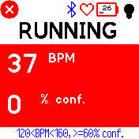
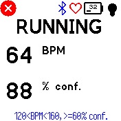
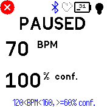

# HeartZone

HeartZone continuously monitors your heart rate. If your heart rate is outside of your configured limits, you get a configurable buzz.

Inspired by [Workout HRM](https://github.com/espruino/BangleApps/tree/master/apps/wohrm), but I wanted the following features:

* Larger text, more contrast, and color-coding for better readability while exercising.
* Configurable buzz interval, instead of at every heart rate reading (which was too distracting).
* Pause for a rest and resume afterwards without having to restart the heart rate sensor (which takes several seconds each time to stabilize).
* Configure the minimum heart rate confidence threshold (bad readings cause buzzes that have to be ignored).

However, compared to Workout HRM, HeartZone doesn't support:

* In-app configuration of the heart rate thresholds - you can only do it in the Settings app.
* Bangle.js 1 - this only supports Bangle.js 2.

## Usage

When you first start the app, it will begin displaying your heart rate after a few seconds. Until the heart rate confidence is above your configured minimum confidence, the background will be colored red:

After the heart rate confidence is at an acceptable level, the background will be colored white, and you will receive buzzes on your wrist while your heart rate is out of the configured range. By default, the BPM-too-low buzz is 200ms, while the BPM-too-high buzz is 1000ms:

If you're taking a break, swipe down to turn off the buzzes while continuing to measure and display your heart rate (swipe up again to end your break):

When you're done, simply press the side button to exit the app.

## Creator

[Uberi](https://github.com/Uberi)
