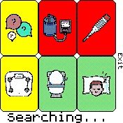

# HeatSuite Watch Application

This is the HeatSuite Watch Application which allows for seemless integration into the HeatSuite platform ([read the docs](https://heatsuitelabs.github.io/HeatSuiteDocs/) and our [research](#research-using-heatsuite)). You may use this watch application independent of the full(er) HeatSuite platform.  

## What is HeatSuite?

HeatSuite is a comprehensive all in one solution for researchers to monitor the physiological, behavioural, and perceptual responses of individuals and their personal environmental exposure. Learn more on the details of the HeatSuite platform by [reading the docs](https://heatsuitelabs.github.io/HeatSuiteDocs/).

## Why do we need this?

Consumer and research-based wearables have largely determined what researchers can measure in the field, and/or have proprietary postprocessing embedded into the hardware/software stack which limits transparency and transferrability of data collected. HeatSuite challenges this one-sided relationship, offering a solution for researchers who desire access and awareness of how and what data they are collecting from *their* participants.

## Watch Specific Features

This is a list of current features available when using the HeatSuite Watch Application:

+ Per minute averaging and/or sum of onboard watch sensor data (Heart rate, barometer temperature and pressure, accelerometer, battery)
+ High temporal resolution accelerometer logging (x,y,z per second)
+ Can connect external bluetooth devices for added physiological monitoring (e.g. Bluetooth Heart Rate, CORE Sensor) - more being added
+ Connect and store data from other devices including:
    + Blood Pressure Monitor (A&D Medical UA651-BLE)
    + Oral Temperature using custom dongle - Contact [Nicholas Ravanelli, PhD](emailto:nick.ravanelli@gmail.com)
    + Body Mass Scale (Xiaomi Composition Scale 2)
+ Collect perceptions and behaviour using ecological momentary assessments with onboard questionnaires
+ Mictruition frequency and color analysis for index of hydration status
+ Create study schedules for participants to receive programmatic nudges daily, specific to each task
+ Programmatic GPS monitoring, with adaptive power switching for battery optimization
+ Fall Detection and bluetooth broadcasting (beta)

## I just installed HeatSuite and I see a bunch of options. What do they mean?

HeatSuite uses a default studyTasks.json - visible and fully editable in the `Tasks` tab when installing HeatSuite on the watch. You can customize this to your liking by following the instructions [in the docs](https://heatsuitelabs.github.io/HeatSuiteDocs/watchapp/watchapp-tasks/). Some specific details are provided in this readme.

## What do the button colors mean?



The colors of each of the buttons provide the user some feedback:

+ <font color="green">Green</font> Means the task has been completed recently, or the user can press the button to navigate to or do a task.*
+  <font color="red">Red</font> means that the task can't be completed yet because another step needs to be done. This example shows that the external devices have yet to be paired with the watch.
+ <font color="yellow">Yellow</font> means you are scheduled to do this task. 

_*Note: If the task requires a bluetooth device, the app will scan for the device and automatically handle the task once found._

## What does `Searching...` at the bottom of the HeatSuite app layout mean?

The `Searching...` text at the bottom of the screen shows that the watch is searching for devices that it may need to connect to via Bluetooth. This text will change when a device is found, and the appropriate handling of the task will ensue. As Bluetooth scanning drains the battery, the HeatSuite App will timeout after 3 minutes and revert back to the clock. 

_Note: This will only show when a bluetooth device is associated with a task._

## Why does swiping right open the HeatSuite App?

The objective of HeatSuite was to make data collection in the field easier for participants. By default, swiping right when the HeatSuite widget is visible will open the app. This can be toggled off in the app settings.

## Can I request or add a feature? 

Certainly!! To help ensure that the release on BangleApps is always functional and works with the other devices within the HeatSuite ecosystem, please make any feature requests or code updates to the forked version within the [HeatSuiteLabs repository](https://github.com/HeatSuiteLabs/BangleApps). That is our testing bed before we push to the official Bangle Apps git.

## Watch accelerometer data

The current interation of the HeatSuite application provides the option to average the accelerometer `x,y,z` every second or as needed (known as High Temporal Resolution Accelerometer Logging), and/or magnitude per minute. Magnitude is calculated in the Espruino firmware as:

``` 
sqrt(x^2 + y^2 + z^2)
```

To transform this to [Euclidean norm minus one (ENMO)](https://journals.plos.org/plosone/article?id=10.1371/journal.pone.0061691) format:

```
ENMO = acc_avg - 1
```
Where `acc_avg` is the average acceleration magnitude per minute, available in the CSV file. While this may be satisfactory for offline long term monitoring (+2 weeks), it is recommended to use per second `mag` data. 

Previous research has demonstrated strong agreement between the onboard accelerometer of the Bangle.js2 and a research grade ActiGraph GT9X;

Van Laerhoven, K., Hoelzemann, A., Pahmeier, I. et al. Validation of an open-source ambulatory assessment system in support of replicable activity studies. *Ger J Exerc Sport Res* 52, 262–272 (2022). https://doi.org/10.1007/s12662-022-00813-2

## Applications/modules that HeatSuite integrates:

* [BTHRM](https://banglejs.com/apps/#bthrm)
* [coretemp](https://banglejs.com/apps/#coretemp)
* [gpssetup](https://banglejs.com/apps/#gpssetup)
* [recorder](https://banglejs.com/apps/#recorder) (modified in HeatSuite code to incorporate per minute averaging)

## Icons

HeatSuite uses icons from [Flaticon.com](https://www.flaticon.com) & [Freepik.com](https://www.freepik.com)

## Research Using HeatSuite

A full list of peer-reviewed research and conference preceedings using HeatSuite can be found [here](https://heatsuitelabs.github.io/HeatSuiteDocs/research/)

## To Do

* Finish Download All and Delete All functions on custom.html
* Graphical User Interface for EMA and Task Development

## Creator

[Nicholas Ravanelli, PhD](https://github.com/nravanelli)
