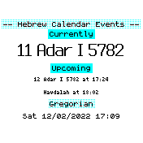

# Hebrew Calendar

Displays the current hebrew calendar date and upcoming holidays alongside a clock

## Usage

Set it up as your clock in the settings

## Features

- Shows the hebrew date, month, and year; alongside the gregorian date
- Shows when upcoming holidays start
- Shows the gregorian day of week, date, and current time

## Controls

N/A

## Requests

Michael Salaverry (github.com/barakplasma)

## Creator

Michael Salaverry
with help from https://github.com/hebcal/hebcal-es6 (MIT license) which is used to calculate the calendar

Icons made by <a href="https://www.flaticon.com/authors/smashicons" title="Smashicons">Smashicons</a> from <a href="https://www.flaticon.com/" title="Flaticon">[www.flaticon.com](https://www.flaticon.com/premium-icon/calendar_3130060?term=jewish&page=1&position=10&page=1&position=10&related_id=3130060&origin=tag)</a>
