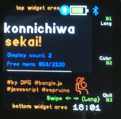

# hello, world!

A cross cultural hello world!/hola mundo! app
The most common testing sentence in several languages ;)

## Pictures:

Launcher icon

Screen - Spanish

Screenshot BJS2 emul

Screen - English

Screen - Japanese

Screenshot BJS1 emul

## Usage

Open and see a hello, World! in the screen 
interact to change language, color or quit.

## Features

 - Compatible Bangle.js1 Bangle.js2
 - Bottom Widget compatible
 - Change FG/BG colors, 
 - Usage of many input events

## Pending/future Features
- replace UI hardcoded colors for dynamic based on theme
- BJS2 change BTN1 from quit to Change FG Color (conflict wit setUI?)

## Controls/UI
 - Left area: Back/Exit/launcher 
 - BTN3 (long press)(BJS1): default Exit/kill app 

 - BTN1 (BJS2): Back/Exit/launcher 
 - BTN1 (BJS1): Change Language
 - BTN2 (BJS1): Change FG Color 
 - BTN3 (BJS1): Quit

 - Right area: Change BG Color 
 - Swipe left: Change Language
 - Swipe right: Change Language 

## Creator

This app is so basic that probably the easiest is to just edit the code 
Otherwise you can contact me [here](https://github.com/dapgo/my_espruino_smartwatch_things)