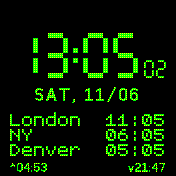

# Hanks World Clock - See the time in four locations

In addition to the main clock and date in your current location, you can add up to three other locations. Great for travel or remote working.  
Additionally we show the sunset/sunrise and seconds for the current location. The day name is shown in your locale.
Also, you can swipe up to show the current time to a friend.

All this is configurable:

 - Show seconds only when unlocked (saves battery) / always / do not show seconds
 - Green color on dark mode (on/off)
 - 1 Offset Small: single location shows as small (like more than 1)
 - Show sun info (on/off) (set your location in the mylocation app)
 - Rotation degree on swipe (off / 90 / 180 / 270)

## Usage

Location for sun set / rise set with mylocation app.  

Provide names and the UTC offsets for up to three other timezones in the App Loader before uploading. These are stored in a json file on your watch. UTC offsets can be decimal (e.g., 5.5 for India).  

The clock does not handle summer time / daylight saving time changes automatically. If one of your three locations changes its UTC offset, you can simply change the setting in the App Launcher and update. Currently the clock only supports 24 hour time format for the additional time zones.

BangleJS2: Swipe up to rotate screen (Target rotation can be set in the settings). Swipe up again to go back to the default rotation. So you can show the time to a friend real quick or temporarily change orientation for sports etc.

## Requests

Please use [the Espruino Forum](http://forum.espruino.com/microcosms/1424/) if you have feature requests or notice bugs.

## Creator

Created by Hank.

Based on the great work of "World Clock - 4 time zones". Made by [Scott Hale](https://www.github.com/computermacgyver)
