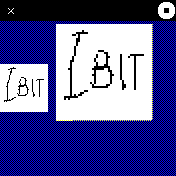

# Icon Bits 

Bitmap editor suitable for creating icons and fonts for BangleJS2.

You'll want to run a copy of this in simulator, and another one on
watch to view the results.

Draw using the provided tools, then press the button, and you'll get
result on the console; you can also use "dump();" on command
line. show_icon() takes same parameter as is used in app-icon.js
files, you can just copy&paste it to get an icon. By using
"for_screen();" command, then taking a screenshot, you can easily
generate app.png file.

It is also possible to load existing icon into editor, using
"load_icon("");" command. At the end of iconbits.app.js file there are
more utility functions.

