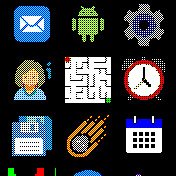

# Icon launcher

A launcher inspired by smartphones, with an icon-only scrollable menu.

This launcher shows 9 apps per screen, making it much faster to navigate versus the default launcher.

## Technical note

The app uses `E.showScroller`'s code in the app but not the function itself because `E.showScroller` doesn't report the position of a press to the select function.
