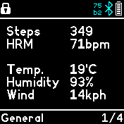
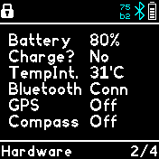
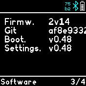

# Info

A very simple app that shows information on 3 different screens.
Go to the next screen via tab right, go to the previous screen
via tab left and reload the data via tab in the middle of the
screen. Very useful if combined with pattern launcher ;)

## Contributors
- [David Peer](https://github.com/peerdavid).

## Thanks To
<a href="https://www.flaticon.com/free-icons/info" title="info icons">Info icons created by Freepik - Flaticon</a>
